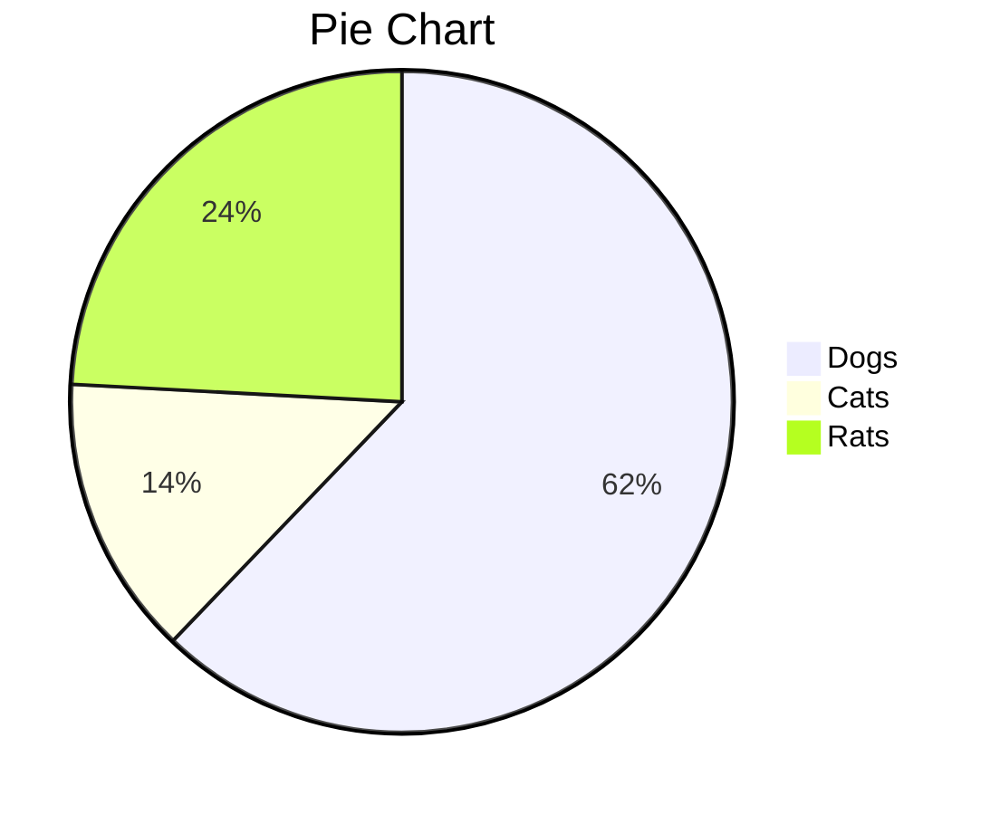

# iandenny.github.io

### Hi Emma, this is my new website on GitHub!!!

##### Heading
---
## Heading 2

### Heading 3

#### Heading 4

1. dfgdfgdf
2. dfgdfg
1. dfgdfgdfgdfgfdg

*this* is a test

Yet a Grenadier is not a Defender, and it bears a much less familiar name and badge - "Ineos", the huge petrochemicals group owned by Britain's richest (£23bn net worth) man, [Sir Jim Ratcliffe](https://ineosgrenadier.com/en/gb/). He also owns 25 per cent of Manchester United, as if he hasn't worries enough.

**hello**

[www.bbc.co.uk](http:www.bbc.co.uk)

|Heading 1|Heading 2|Cost|
|---------:|:---------|:---|
| Data 1 | Data 2 fghfghfghfghfghfghfghfgh |1.00|
| Data 1 | Data 2  |0.01|
| Data 1 | Data 2  |30.00|
| 445-0793456 | 45HP DC Motor |0.50|
|fsdfsdfsd|fsdfsdf|dfd

- Item 1
- Item 2
    - sdfsf
    - sfsdf
        - dfdf
        - dfdf
- Item 3
- iererer

1. Item 1
2. Item 2

 some **blue** text

This is a paragraph of test that 
should be distlayes all together
dfgdfgfdgfdgdfg.

> this is a quote
>
>>Nested quote
>> Hello

1. sdfsdf
2. dfdfgdfg
    1. svbnvbnbvnvbndfdsf
    2. fdgdfvbnvbnvbng

~~~html
    <html>
        <head>
        dfdfdsf
        sfsf
        </Head>
    </html>
~~~

~~~C++
{
#include <iostream>
#include <vector>
#include <thread>
#include <mutex>

// Forgot to include this section
#include <semaphore>
#include <atomic>
#include <chrono>
#include <map>
#include <random>
}
~~~

Here is some
**nice code**
to define the constant expressions.

~~~C++
// Constants to define the elevator system's properties
constexpr int TOTAL_LEVELS = 10; // Total number of floors in the building
constexpr int MAX_CAPACITY = 3; // Maximum number of passengers the elevator can hold
constexpr int MOVE_DURATION = 2000; // Time in milliseconds it takes the elevator to move between floors
constexpr int STOP_DURATION = 500; // Time in milliseconds for the elevator to stop at a floor (not used here)
~~~

$h^2=p^2+b^2$

$$
\int_{50}^{10} x^5 dx
$$

$$\frac{dfsdfsdfn!}{k!(n-k)!}$$

$$\sqrt[n]{k}$$

$$=\frac{[4*5]^4}{2}$$

$$=20$$

$$\int_0^\infty \mathrm{e}^{-x},\mathrm{d}x$$

$$\frac{\frac{x}{1}}{x - y}$$

Some text above the expression.

$$ f(x) = \int_{-\infty}^\infty
    \hat f(\xi)\,e^{2 \pi i \xi x}
    \,d\xi $$

Some text below the expressiion.
 
 

$$\sum_{k=1}^n k = \frac{n(n+1)}{2}$$
$$\int_a^b f(x)\,dx$$
